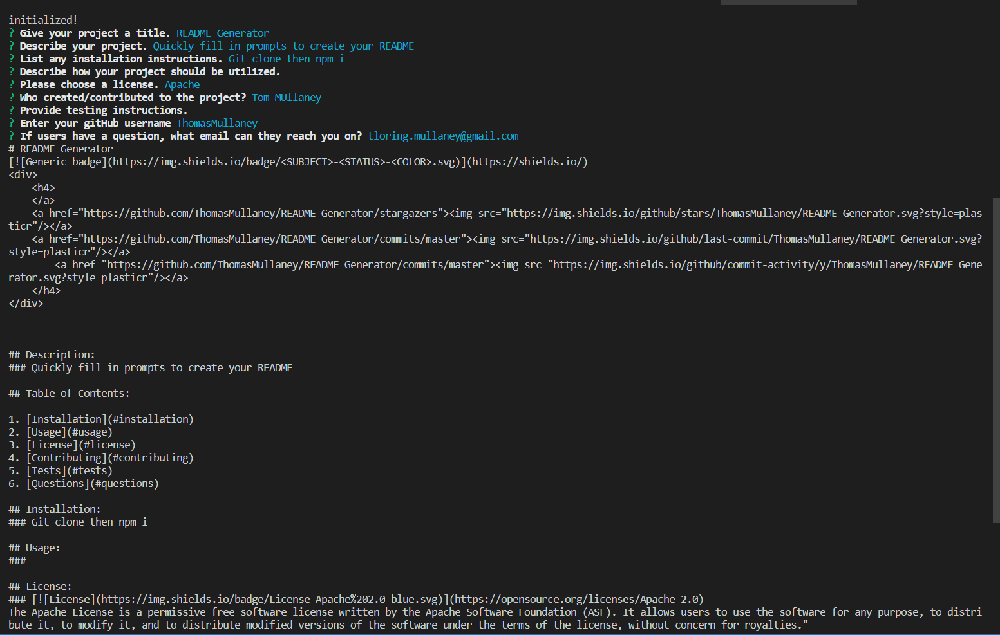

# README Generator

  <h4>
    </a>
    
    
        
</h4>

This is a README generator application

  <h4>
    <a href="https://github.com/ThomasMullaney/README-Generator">
      Github Repository
    </a>
 | 
<a href="https://thomasmullaney.github.io/README-Generator/">
      Github Pages
    </a>
     | 
<a href="https://drive.google.com/file/d/1a72rUw6RnszpkPKlYYCbUsIiGrI2OiIR/view">
      Video Walkthrough
    </a>
  </h4>

## Description:
### A node application utilizing inquirer to help users quickly create more detailed READMEs.

## Table of Contents:
     
 1. [Installation](#installation)
 2. [Usage](#usage)
 3. [License](#license)
 4. [Contributing](#contributing)
 5. [Tests](#tests)
 6. [Questions](#questions) 

 ## Installation: 
 ### Clone the repo and npm install before starting.

 ## Usage:
 ### Within the terminal type "node index.js" to initialize prompts.

 ## License:
 ### 
 The Apache License is a permissive free software license written by the Apache Software Foundation (ASF). It allows users to use the software for any purpose, to distribute it, to modify it, and to distribute modified versions of the software under the terms of the license, without concern for royalties."
    
 ## Contributing:
 ### Tom Mullaney

 ## Tests:
 ### 

    
 ## Questions:
 ### github.com/ThomasMullaney
 ### tloring.mullaney@gmail.com
    
